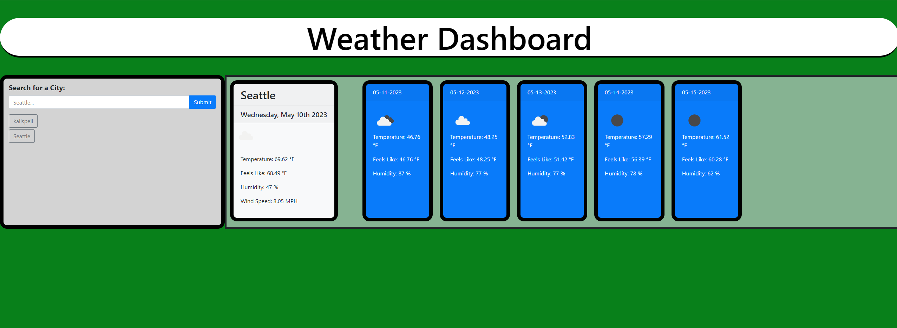

# WeatherDashboard
        
## Description
        
    This application is to get the current and future weather of cities that are requested!
    This website was built to function as another weather application that you can go to to get your daily source
    of what the upcoming weather will look like.
        
## Usage
        
    Follow the link to the website and then input a wanted city into the website.
        

## Website

## Link
https://jaydenschuff.github.io/WeatherDashboard/ <--- Deployed Website
   
### Sources
https://github.com/CodyG-2021/06-Server-Side-APIs-Weather-Dashboard
